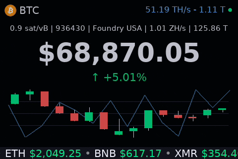
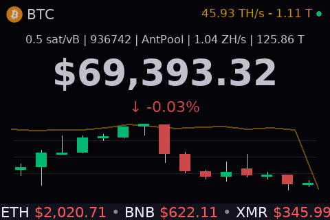
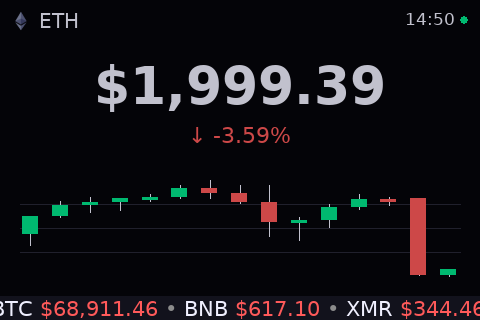
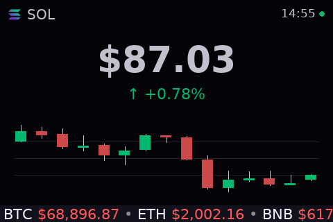

<div align="center">
  
# Crypto Ticker & Local Home-Miner Monitor 
for Raspberry Pi TFT/HDMI Displays

[](https://www.raspberrypi.com/)
[](https://www.python.org/)
[](https://www.pygame.org/)
[](https://opensource.org/licenses/MIT)



</div>

<br>

<p align="center">Real-time prices, candlestick chart, local miners' hashrate, and Bitcoin network stats, all in one dashboard.</p>

## Screenshots

<div align="center">
  <table style="width:100%; max-width:900px;">
    <tr>
      <td align="center">
        
      </td>
      <td align="center">
        
      </td>
      <td align="center">
        
      </td>
    </tr>
  </table>
</div>

## Table of Contents

- [Features](#features)
- [Hardware](#hardware)
- [System Prerequisites](#system-prerequisites)
- [Installation](#installation)
- [Project Structure](#project-structure)
- [Configuration Notes](#configuration-notes)
- [Troubleshooting](#troubleshooting)
- [License](#license)
- [Acknowledgments](#acknowledgments)
- [Support The Project](#support-the-project)

## Features

### 📈 Market Data (from Binance, Kraken and Coingecko)
- Real-time prices for one or more primary pairs + configurable altcoins via WebSocket (with fallback)
- Primary pairs auto-rotate (~21 seconds) when multiple are configured
- 1-minute candlestick chart for active primary pair (duration & max candles configurable)
- Scrolling marquee: configurable altcoins with prices and 24h change coloring (green/red)

### ⛏️ Local Miner Monitoring (shown only if miners configured)
- Aggregated local miner stats:
  - Total hashrate (TH/s)
  - Best share difficulty among connected miners
  - Connected/active count
  - Color-coded health indicator (blue: all good, orange: partial, red: issues)
- Hashrate overlay curve from aggregated local miners on the chart
- Miner section auto-hides when `miners_ips` is empty (time is shown instead)

### 🌐 Bitcoin Network Stats (from mempool.space)
- Recommended fees (sat/vB)
- Current block height
- Latest block mining pool
- Network hashrate (EH/s)
- Network difficulty

### ⚙️ UX / Performance / Config
- Global connection status indicator (green/orange/red circle)
- Fully configurable via `config.json` (reloads on start)
- Optimized for Raspberry Pi: configurable 25 FPS cap, static background, low CPU usage
- Native 480×320 for 3.5" TFT + auto-scaling (with preserved aspect ratio) on HDMI displays
- Automatic reconnection, thread-safe data, rotating logs

Perfect for an always-on TFT/HDMI crypto dashboard on Raspberry Pi 3B+, 4 or 5.

## Hardware

Developed and tested with:
  - Raspberry Pi 3B+, 4, 5
  - Waveshare 3.5" TFT touchscreen (480×320, XPT2046 controller)
  - HDMI monitors (auto-scaled with preserved aspect ratio)

## System Prerequisites

- The Raspberry Pi must be on the same local network as the miners.
- Make sure `/boot/firmware/config.txt` has `dtoverlay=vc4-kms-v3d` enabled.

Before installing the Python dependencies, make sure you have the necessary system packages for Pygame and graphical support.

Run the following command:

```bash
sudo apt update && sudo apt install python3-venv python3-pygame libsdl2-dev libegl-dev
```

Additionally, add the user to the video and input groups to avoid permission issues with the framebuffer:

```bash
sudo usermod -aG video,input $USER
```

Log out and log back in (or reboot) for the group changes to apply.

## Installation

1. Clone the repository:

```bash
git clone https://github.com/DozNot/rpi-crypto-ticker-display.git
cd rpi-crypto-ticker-display
```

2. Create and activate a virtual environment (recommended):

**Important**: Use the system-provided `python3-pygame` package (from apt) for best compatibility with Raspberry Pi's kmsdrm driver.

```bash
python3 -m venv --system-site-packages venv
source venv/bin/activate
```
Why `--system-site-packages`?

→ This allows the `venv` to use the optimized system `pygame` while keeping other dependencies isolated.

3. Install dependencies:

```bash
python3 -m pip install -r requirements.txt
```

4. Copy and edit the configuration file (miners hidden if `"miners_ips"` is empty):

```bash
cp config.example.json config.json
nano config.json
```

- Example config.json:
```json
{
  "miners_ips": [
    "192.0.2.100",
    "192.0.2.101",
    "192.0.2.102",
    "192.0.2.103"
  ],
  "btc_logo_path": "logos/btc.png",
  "fps": 25,
  "dim_alpha": 50,
  "candle_seconds": 60,  
  "max_candles": 14, 
  "marquee_height": 24,
  "marquee_speed": 1.0,
  "marquee_refresh_interval": 8.0,
  "main_symbols": ["BTCUSDT", "DOGEUSDT"], 
  "marquee_symbols": [
    "ETHUSDT", "BNBUSDT", "XMRUSDT", "SOLUSDT", "LTCUSDT",
    "XRPUSDT", "ADAUSDT", "TRXUSDT", "MEUSDT", "HBARUSDT", "ESXUSD",
    "XECUSDT", "RUNECOIN"  
  ],
  "price_decimals": {
    "xecusdt": 8,
    "esxusd": 6,
    "runecoin": 8
  },
  "kraken_pairs": {
    "xmrusdt": "XMR/USDT",
    "esxusd": "ESX/USD"
  },
  "coingecko_ids": {
    "runecoin": "runecoin"
  },
  "miner_active_threshold": 0.25, 
  "data_timeout": 300,
  "hashrate_curve_thickness": 2, 
  "wifi_check_interval": 12.0
}
```
→ Replace IPs with your real miner IP addresses (BitAxe/NerdQaxe/etc.)

→ If no miners, leave `"miners_ips": []` empty to hide the miner feature (make sure you remove example IPs)

5. Run the application:

```bash
python3 app.py
```
- Then make it start automatically at boot (systemd, crontab @reboot, etc.) 
- Recommended for a dedicated dashboard

## Project Structure
```bash
rpi-crypto-ticker-display/
├── app.py                  # Main entry point
├── config.json             # User configuration
├── config.example.json     # Template: copy to config.json and edit
├── LICENSE                 # Project license
├── requirements.txt        # Python dependencies
├── assets/                 # Images/GIFs used in README
│   ├── demo.gif            # Demo animation
│   ├── btc-qr.png          # BTC QR
│   ├── xmr-qr.png          # XMR QR
│   └── ...                 
├── logos/                  # Crypto logo images
│   ├── btc.png
│   ├── eth.png
│   └── ...                
├── logs/
│   └── app.log             # Rotating log file (INFO/WARNING/ERROR)
├── src/                    # Source code modules
│   ├── __init__.py
│   ├── constants.py        # Constant values and settings
│   ├── data.py             # Price and market data fetching
│   ├── helpers.py          # Utility functions
│   ├── mempool.py          # Mempool/BTC network data
│   ├── miners.py           # Local miner monitoring
│   ├── rendering.py        # Display rendering and drawing logic
│   └── websockets.py       # WebSocket connections for live data
└── README.md               # Project documentation and setup guide
```

## Configuration Notes

All paths are relative to the project root.

- `miners_ips`: List of local miner IP addresses (BitAxe, NerdAxe, etc.).  
- `btc_logo_path`: Path to the Bitcoin logo.  
- `fps`: Display refresh rate in frames per second.  
- `dim_alpha`: Transparency level for the dimming/fade effect (0-255).  
- `candle_seconds`: Duration in seconds for each candlestick on the price chart.  
- `max_candles`: Maximum number of candlesticks displayed on screen.  
- `marquee_height`: Height in pixels of the scrolling marquee.  
- `marquee_speed`: Scrolling speed of the marquee (higher value = faster).  
- `marquee_refresh_interval`: Interval in seconds to refresh price data in the marquee.  
- `main_symbols`: List of primary symbols shown. Add or remove as desired.
- `marquee_symbols`: List of symbols to scroll in the marquee. Add or remove as desired.
- `price_decimals`: Force decimals shown for specific symbols. Useful for low-value coins.
- `kraken_pairs`: Mapping for symbols that use the Kraken API instead of Binance.  
- `coingecko_ids`: Mapping for symbols that use CoinGecko (for coins not listed elsewhere).  
- `miner_active_threshold`: Minimum threshold to consider a miner "active".  
- `data_timeout`: Timeout in seconds for data requests (prices, hashrate, etc.).  
- `hashrate_curve_thickness`: Thickness of the hashrate curve line.  
- `wifi_check_interval`: Interval in seconds to check WiFi connection status.  

→ If `config.json` is missing, invalid, or corrupted, the program falls back to defaults.

## Troubleshooting

- `pygame.error: video system not initialized` or black screen:
  
  → Ensure you used `--system-site-packages` when creating the venv and installed `python3-pygame` via apt.¹
  
  → Verify `/boot/firmware/config.txt` contains or enables `dtoverlay=vc4-kms-v3d` (and reboot).
  
- No display → Verify SDL environment vars in `app.py`. Check `/dev/fb0` exists.
- No prices/"Connecting…" forever → Internet required. Check firewall, DNS. Check logs for details.
- Miners not showing / red indicator → Verify IPs, miner WebSocket/API enabled, no firewall block.
- High CPU → Lower FPS in `config.json` (default 25 → try 15-20).
- Marquee stuck/empty → Wait 8–10 seconds after start. Check logs for rebuild errors.
- Candlestick chart missing → Needs at least 2 candles (wait ~2 min after start).

¹ *The pip-only version of pygame often fails with kmsdrm on Raspberry Pi OS.*  

→ Logs are written to `./logs/app.log`

## License

MIT License – see LICENSE file

## Acknowledgments

- Market data: Binance, Kraken, Coingecko public APIs
- Bitcoin Network stats: mempool.space
- Open-source Bitcoin Community and Home-Miners (OSMU/BitAxe/NerdQaxe/etc.)

## Support the Project

If you find this project useful, consider supporting its development with a small donation. Thank you!

<br>

<div align="center">
  
<table>
  <tr>
    <th align="center"><strong style="font-size: 1.3em;">[ BITCOIN ]</strong></th>
    <th align="center"><strong style="font-size: 1.3em;">[ MONERO ]</strong></th>
  </tr>
  <tr>
    <td align="center">
      <br><br><br>
    </td>
    <td align="center">
      <br><br><br>
    </td>
  </tr>
</table>

</div>

<div>
  <p>Bitcoin:</p>
  
```bash
bc1qkaqaxqheejuddrp5604wy592k423vjmk3uu35l
```
</div>

<div>
<p>Monero:</p>
  
```bash
457KEpgmvXJgNSnrkVs2poFPCVNXxPoqBAnxjSC1T9C3QUSSxXMR3iLFx1LtPc77oUAmoVwHgrh7KGzFugVpc1RCJ9nR3PS
```
</div>
